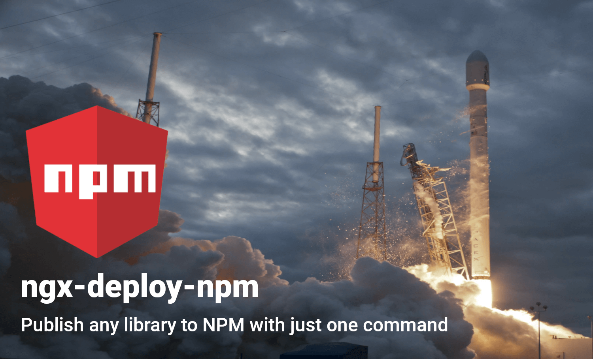

# ngx-deploy-npm 🚀

[![NPM version][npm-image]][npm-url]
[](http://opensource.org/licenses/MIT)

### **Deploy your Angular Package to NPM directly from the Angular CLI! 🚀**



---

**Table of contents:**

- [⚠️ Prerequisites](#prerequisites)
- [🚀 Quick Start (local development)](#quick-start)
- [🚀 Continuous Delivery](#continuous-delivery)
  - [CircleCI](#circleci)
- [📦 Options](#options)
  - [--configuration](#--configuration)
  - [--package-version](#--package-version)
  - [--tag](#--tag)
  - [--access](#--access)
  - [--otp](#--otp)
  - [--dry-run](#--dry-run)
- [📁 Configuration File](#configuration-file)
- [🧐 Essential considerations](#essential-considerations)
- [🏁 Next milestones](#next-milestones)
- [License](#license)
- [🚀 Powered By ngx-deploy-starter](#-powered-by-ngx-deploy-starter)

---

## ⚠️ Prerequisites <a name="prerequisites"></a>

This command has the following prerequisites:

- Angular project created via [Angular CLI](https://github.com/angular/angular-cli) v8.3.0 or greater (execute `ng update @angular/cli @angular/core` to upgrade your project if necessary)

## 🚀 Quick Start (local development) <a name="quick-start"></a>

This quick start assumes that you already have an existing Angular project with a publishable package created and you already are logged in on npm using `npm login`

1. Add `ngx-deploy-npm` to your project. It will configure all your publishable libraries present in the project

   ```sh
   ng add ngx-deploy-npm
   ```

2. Deploy your library to NPM with all default settings. Your library will be automatically built in production mode.

   ```sh
   ng deploy your-library
   ```

3. Your library should be published on npm. So go and check npm.js

## 🚀 Continuous Delivery <a name="continuous-delivery"></a>

Independently of the CI/CD that you are using you must create an NPM token. To do so, you have two methods

- Via [NPM web page](https://docs.npmjs.com/creating-and-viewing-authentication-tokens)
- Using [`npm token create`](https://docs.npmjs.com/cli/token.html)

### [CircleCI](http://circleci.com)

1. **Set the env variable**
   - On your project setting ser the env variable. Let's call it `NPM_TOKEN`
2. **Indicate how to find the token**
   - Before publishing, we must indicate to npm how to find that token, do it by creating a step with `run: echo '//registry.npmjs.org/:_authToken=${NPM_TOKEN}' > YOUR_REPO_DIRECTORY/.npmrc`
   - Replace `YOUR_REPO_DIRECTORY` for the path of your project, commonly is `/home/circleci/repo`
3. **(Optional) check that you are logged**
   - Creating a step with `run: npm whoami`
   - The output should be the username of your npm account
4. **Deploy your package**
   - Create a step with `run: npx ng deploy YOUR_LIBRARY`
   - **NOTE:** You may want to execute a script that executes some pre-steps before publishing and inside that script execute `ng deploy YOUR_LIBRARY`. If you want to make that script on JavaScript and put it on the package.json, **execute it using `npm` not with yarn**, there is an [issue](https://github.com/yarnpkg/yarn/issues/5683) associated with that
5. **Enjoy your just released package 🎉📦**

The job full example is

```yml
# .circleci/config.yml
jobs:
  init-deploy:
    executor: my-executor
    steps:
      - attach_workspace:
          at: /home/circleci/repo/
      # Set NPM token to be able to publish
      - run: echo '//registry.npmjs.org/:_authToken=${NPM_TOKEN}' > /home/circleci/repo/.npmrc
      - run: npm whoami
      - run: ngx ng deploy YOUR_PACKAGE
```

###### You can check the steps suggested in the [CircleCI's guide](https://circleci.com/blog/publishing-npm-packages-using-circleci-2-0/)

## 📦 Options <a name="options"></a>

#### --configuration

- **optional**
- Alias: `-c`
- Default: `production` (string)
- Example:
  - `ng deploy` – Angular project is build in production mode
  - `ng deploy --configuration=test` – Angular project is using the configuration `test` (this configuration must exist in the `angular.json` file)

A named build target, as specified in the `configurations` section of `angular.json`.
Each named target is accompanied by a configuration of option defaults for that target.
Same as `ng build --configuration=XXX`.

#### --package-version

- **optional**
- Default: Doesn't have any default value [string]
- Example:
  - `ng deploy --package-version 2.3.4`

It's going to put that version on your `package.json` and publish the library with that version on NPM.

#### --tag

- **optional**
- Default: `latest` (string)
- Example:
  - `ng deploy --tag alpha` – Your package will be available for download using that tag, `npm install your-package@alpha` useful for RC versions, alpha, betas.

Registers the published package with the given tag, such that `npm install @` will install this version. By default, `npm publish` updates and `npm install` installs the `latest` tag. See [`npm-dist-tag`](https://docs.npmjs.com/cli/dist-tag) for details about tags.

#### --access

- Default: `public` (string)
- Example:
  - `ng deploy --access public`

Tells the registry whether this package should be published as public or restricted. It only applies to scoped packages, which default to restricted. If you don’t have a paid account, you must publish with --access public to publish scoped packages.

#### --otp

- **optional**
- Default: Doesn't have any default value (string)
- Example:
  - `ng deploy --otp TOKEN`

If you have two-factor authentication enabled in auth-and-writes mode then you can provide a code from your authenticator with this.

#### --dry-run

- **optional**
- Default: `false` (boolean)
- Example:
  - `ng deploy --dry-run`

For testing: Run through without making any changes. Execute with --dry-run and nothing will happen. A list of options will be printed

## 📁 Configuration File <a name="configuration-file"></a>

To avoid all these command-line cmd options, you can write down your configuration in the `angular.json` file in the `options` attribute of your deploy project's architect. Just change the kebab-case to lower camel case. This is the notation of all options in lower camel case:

- access
- configuration
- dryRun
- packageVersion
- otp
- tag

A list of all available options is also available [here](https://github.com/bikecoders/ngx-deploy-npm/blob/master/src/deploy/schema.json).

Example:

```sh
ng deploy your-library --tag alpha --access public --dry-run
```

becomes

```json
"deploy": {
  "builder": "ngx-deploy-npm:deploy",
  "options": {
    "tag": "alpha",
    "access": "public",
    "dryRun": "true"
  }
}
```

And just run `ng deploy` 😄.

> ℹ️ You can always use the [--dry-run](#dry-run) option to verify if your configuration is right.

## 🧐 Essential considerations <a name="essential-considerations"></a>

### README, LICENCE, and CHANGELOG

Those files must be in the root of the library. They are being copied by the builder at the moment of deployment.

If you have those files outside the project's root, you can create a symbolic link to solve that problem.

> See [symbolic links on git](https://www.mokacoding.com/blog/symliks-in-git/) to know how to create them properly.

### Version bumping

This deployer doesn't bump or generates a new version of the package, it just builds the **package/library**, take the package.json as it and **publish** it. You can use [`--package-version`](#--package-version) option to change it.

### Only publishable libraries are being configured

A publishable library is one that can be built. Here we detect that if the library in the `angular.json` has the architect **build** with the builder `@angular-devkit/build-ng-packagr:build`.

The `angular.json` look like

```json
{
  "publishable-library": {
    "projectType": "library",
    "root": "libs/publishable-library",
    "sourceRoot": "libs/publishable-library/src",
    "prefix": "myworkspace",
    "architect": {
      "build": {
        "builder": "@angular-devkit/build-ng-packagr:build",
        "options": {
          "tsConfig": "libs/publishable-library/tsconfig.lib.json",
          "project": "libs/publishable-library/ng-package.json"
        }
      }
    }
  }
}
```

This takes a special context on a [NX](https://nx.dev) environment.

## 🏁 Next milestones <a name="next-milestones"></a>

We are looking forward to the following features:

- Implement Continuous Everything:
  - Integration
  - Inspection
  - Delivery
- Specify which library add the deployer on the `ng add`
- Add all the RFC proposals of [ngx-deploy-starter](https://github.com/angular-schule/ngx-deploy-starter)
- Custom README, LICENCE, and CHANGELOG paths

Your feature that's not on the list yet?

We look forward to any help. PRs are welcome! 😃

## License <a name="license"></a>

Code released under the [MIT license](LICENSE).

## 🚀 Powered By [ngx-deploy-starter](https://github.com/angular-schule/ngx-deploy-starter)

[npm-url]: https://www.npmjs.com/package/ngx-deploy-npm
[npm-image]: https://badge.fury.io/js/ngx-deploy-npm.svg
